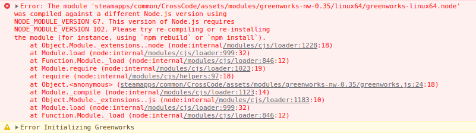
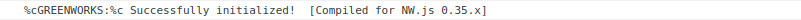

Linux version of CrossCode uses Greenworks library that's incompatible with NW.js used by the game.

Greenworks is a Steamworks API library, which is why achivements aren't working.

However, it's possible to just replace the library with compatible version, which is what this repository provides.

# Installation

Download replacement library from [Releases](https://github.com/awaken1ng/crosscode-greenworks/releases), and extract `assets` folder inside to CrossCode folder, replacing 6 files.
